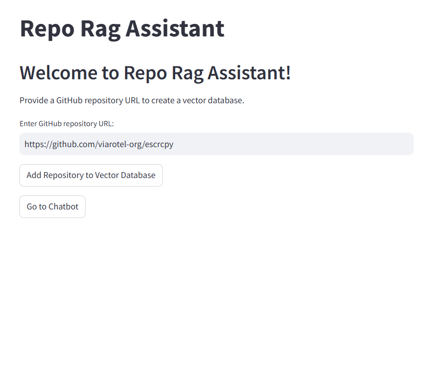
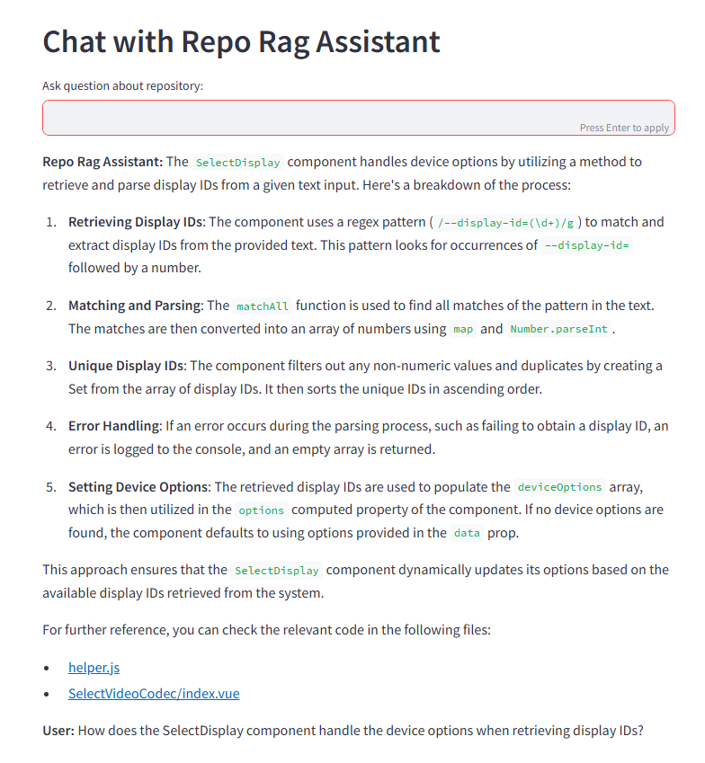
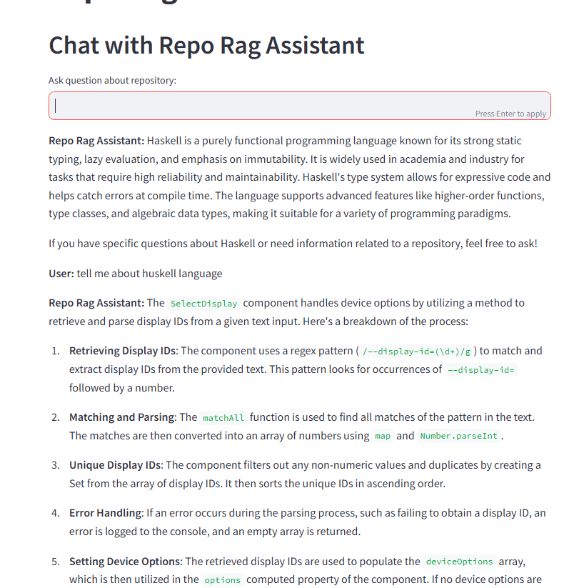

# RepoRAG

## Table of contents

1. **[Description](#description)**
   1. [Indexing](#indexing)
   2. [Approaches Used](#approaches-used)
   3. [Models Evaluation](#models-evaluation)
   4. [ReAct Agent System and Streamlit Interface](#react-agent-system-and-streamlit-interface)
2. **[Technologies](#technologies)**
3. **[Development](#development)**
   1. [Quick start](#quick-start)
   2. [Scripts](#scripts)
   3. [Launching](#launching)

## Description

This repository implements a Retrieval-Augmented Generation (RAG) system designed for working with GitHub code repositories. The system provides pipeline for indexing and querying code, allowing to retrieve and interact with relevant parts of code using natural language.

### Indexing

The system begins with indexing, where the user provides a GitHub repository URL. The `scripts/build_index.py` script handles the indexing process. I split the code using `\n` as a delimiter, creating chunks of 1024 tokens with an overlap of 64 tokens. This approach avoids excessively large chunks, which are generally rated poorly by similarity metrics (L2 distance in my case), while maintaining structure. Moreover, it's usually not necessary to retrieve entire file - just relevant parts are enough. The choice of `\n` as the delimiter helps keep the chunks focused on actual code blocks.

### Approaches Used

- **Baseline**: simple similarity search without any enhancements
- **MMR (Maximal Marginal Relevance)**: used to improve the diversity of retrieved results by balancing relevance and novelty. This technique aims to select the most relevant documents while avoiding redundancy in the results.
- **Query Expansion**: using a language model (LLM), the query is expanded to provide additional context. This helps to improve the understanding of the user's intent, leading to more relevant retrieval results.
- **Query Extraction**: using few-shot prompting, another LLM-based approach, Query Extraction, focuses on extracting key terms from the query and then adding these terms to initial query.
- **Rerankers**:
  - **CrossEncoder Reranker**: CrossEncoder model evaluates the relationship between the query and the documents by scoring each document-query pair. I utilized the [MS MARCO MiniLM-L6-v2 model](https://huggingface.co/cross-encoder/ms-marco-MiniLM-L6-v2) for this approach, which allows for a more precise ranking of the retrieved documents.
  - **Listwise Reranker**: a model trained to rank multiple documents as a list rather than individually. I used [ListConRanker](https://huggingface.co/ByteDance/ListConRanker) for this approach, which ranks the documents based on their relevance to the query, considering the entire list of retrieved results.

### Evaluation Metric

My quality criterion was **Recall@10**, a metric used to evaluate how effectively the retrieval system returns relevant items within the top 10 results. It measures the proportion of relevant documents (or code snippets, in this case) that appear in the top 10 results retrieved for a given query.

In the context of my retrieval system, since the system can return multiple chunks from the same file, I handle this by first retrieving 50 potential results. From those, I select the top 10 unique files in ranking order. Recall@10 is then computed by checking how many of the relevant files appear within those top 10 unique results.

### Models Evaluation

I tested multiple models to evaluate their performance in retrieving relevant code snippets from test dataIt's important to highlight that the results may not be fully reliable depending on whether the test data is representative. Below are the results for the models I implemented:

| Model                                 | Recall@10 | Mean Latency (seconds) |
| ------------------------------------- | --------- | ---------------------- |
| Baseline Model (Without Enhancements) | 0.62      | 0.55                   |
| Model with MMR Selection              | 0.57      | 1.10                   |
| Model with Query Expansion            | 0.64      | 1.84                   |
| Model with Query Extraction           | 0.67      | 1.51                   |
| Model with CrossEncoder Reranker      | 0.57      | 5.76                   |
| Model with Listwise Reranker          | 0.54      | 93.89                  |

The evaluation highlights the trade-offs between retrieval quality (**Recall@10**) and computational cost (**Mean Latency**). However, latency might vary depending on OpeanAi API response times or internet connection stability. Therefore, additional testing is recommended to get more reliable results. Also it's important to highlight that the **Recall@10** results may not be fully reliable depending on whether the test data is representative. Models with query extraction or query expansion generate additional tokens, but query extraction typically generates only small amount of output tokens as it just extracts key terms.

- **Best Performance (Query Extraction)**

  - Achieves the highest retrieval quality, making it the best choice for maximizing relevant results.
  - Maintains a reasonable latency, balancing speed and accuracy effectively.

- **Fastest Model (Baseline)**

  - The simplest model, offering decent retrieval performance with minimal computational cost.
  - Suitable for real-time applications where speed is prioritized over slight gains in recall.

- **Rerankers**

  - Extremely slow due to computational complexity.
  - It also shows worse recall performance compared to Query Extraction, making it a less effective trade-off.

### Conclusion

- **For real-time performance**, the **Baseline model** is optimal.
- **For the best recall with reasonable latency**, **Query Extraction** is the most balanced option.

### ReAct Agent System and Streamlit Interface

In addition to the retrieval system, I implemented a ReAct agent system, utilizing the best-performing model (Query Extraction). This agent can, for example, generate summaries of the retrieved code snippets while also providing links to the corresponding files on GitHub. It first determines whether the user's query is related to the repository's code; if so, it retrieves relevant data and uses it in the response, avoiding redundant retrieval. The cagent also features memory, enabling it to retain context across interactions

I also built a simple web chatbot interface using Streamlit. The app allows users to load code from a GitHub repository into a database and interact with agent.

<p align="center">
  
  <br>
  <span>Interface for adding uploading reposiotry documnets to vector database</span>
</p>

<p align="center">
  
  <br>
  <span>Example of chatbot interaction using query from test data</span>
</p>

<p align="center">
  
  <br>
  <span>Example of chatbot interaction using unrelated question</span>
</p>

## Technologies

Project uses following languages and technologies

- Python 3
- LangChain
- LangGraph
- OpenAI
- HuggingFace
- Streamlit

## Development

### Quick start

If you want to set up project locally

1. Create new virtual environment:

   If you use _conda_

   ```
   conda create --name your-environment-name python=3.10
   ```

   if use _venv_

   For Linux/macOS:

   ```bash
   python3 -m venv your-environment-name
   ```

   For Windows:

   ```powershell
   python -m venv your-environment-name
   ```

2. Activate environment

   ```
   conda activate your-environment-name
   ```

   For Linux/macOS:

   ```bash
   source your-environment-name/bin/activate
   ```

   For Windows (Command Prompt):

   ```cmd
   your-environment-name\Scripts\activate
   ```

   For Windows (PowerShell):

   ```powershell
   your-environment-name\Scripts\Activate.ps1
   ```

3. Make sure you use recent _pip_ version

   ```
   python -m pip install --upgrade pip
   ```

4. Install packages

   ```
   python -m pip install -e .
   ```

5. create `.env` file and fill it according to template below

   ```
   OPENAI_API_KEY="<your_openai_api_key>"
   GITHUB_TOKEN="<your_github_token>"
   ```

### Scripts

**BEFORE RUNNING EVALUATION SCRIPTS PUT JSON WITH EVAUATION QUESTIONS IN `data/` FOLDER**

1. **Build Index**  
   **Side Note:**  
   The process of adding loaded documents is batched to avoid OpenAI rate limiting issues (for 1 tier), with documents being added in batches of `batch_size`. If the number of documents exceeds the batch size, the function waits for 1 minute before continuing. The `batch_size` can be adjusted by the user when running the script.

   ```
   python scripts/build_index.py
   ```

2. Evalute Baseline Model
   ```
   python scripts/baseline.py
   ```
3. Evalute MMR
   ```
   python scripts/mmr.py
   ```
4. Evaluate query expansion
   ```
   python scripts/query_expansion.py
   ```
5. Evaluate rerankers
   ```
   python scripts/rerankers.py
   ```
6. Evaluate key terms extraction
   ```
   python scripts/query_extraction.py
   ```

### Launching

1. To launch streamlit app
   ```
   streamlit run src/repo_rag/app.py
   ```
